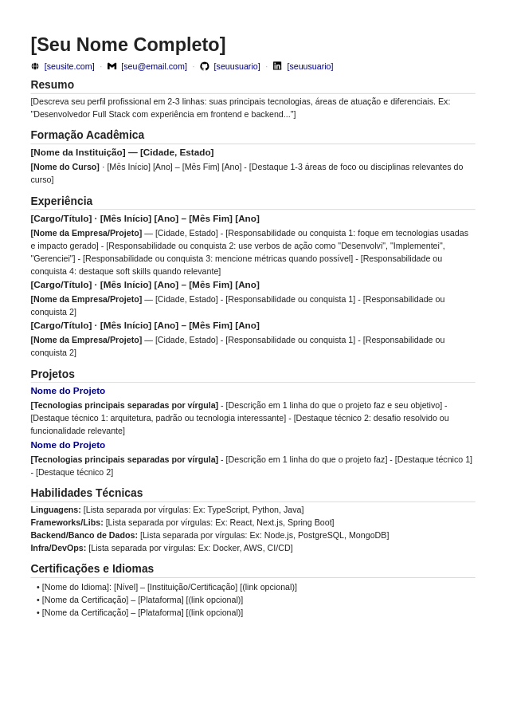

# Gerador de Currículo em PDF



Sistema para gerar currículos em PDF a partir de Markdown com configuração personalizável.

## Como Usar

### 1. Suas informações pessoais

Edite o arquivo `config.json`:

```json
{
  "name": "Seu Nome Completo",
  "contacts": [
    {
      "type": "website",
      "icon": "icons/web.svg",
      "url": "https://seusite.com",
      "display": "seusite.com"
    },
    {
      "type": "email",
      "icon": "icons/gmail.svg",
      "url": "mailto:seu@email.com",
      "display": "seu@email.com"
    },
    {
      "type": "github",
      "icon": "icons/github.svg",
      "url": "https://github.com/seuusuario",
      "display": "seuusuario"
    },
    {
      "type": "linkedin",
      "icon": "icons/linkedin.webp",
      "url": "https://linkedin.com/in/seuusuario",
      "display": "seuusuario"
    }
  ]
}
```

### 2. Editar o conteúdo do currículo

Edite o arquivo `curriculo.md` com suas informações seguindo o template.

### 3. Gerar o PDF

**Opção 1: Usando o Makefile (recomendado)**
```bash
# Gera todos os PDFs
make all

# Ou apenas
make
```

**Opção 2: Usando Python diretamente**
```bash
# Uso básico (usa config.json por padrão)
python build.py curriculo.md curriculo.pdf

# Ou especifique um arquivo de configuração diferente
python build.py curriculo.md curriculo.pdf meu_config.json
```

## Estrutura de Arquivos

```
.
├── build.py          # Script de conversão
├── config.json         # Suas informações pessoais
├── curriculo.md        # Conteúdo do currículo
├── style.css           # Estilos do PDF
├── Makefile            # Automação de tarefas
├── icons/              # Ícones usados no cabeçalho
│   ├── web.svg
│   ├── gmail.svg
│   ├── github.svg
│   └── linkedin.webp
├── output/             # Diretório com PDFs gerados (criado automaticamente)
    └── curriculo.pdf

```

### Usar Múltiplos Perfis

Crie diferentes arquivos de configuração:

```bash
python build.py curriculo.md curriculo_tech.pdf config_tech.json
python build.py curriculo.md curriculo_design.pdf config_design.json
```
    
## Requisitos

```bash
pip install markdown weasyprint
```

## Dicas

- Mantenha o `display` curto para não quebrar o layout
- Use ícones SVG para melhor qualidade
- O separador `·` é adicionado automaticamente entre os contatos
- Você pode mudar o nome do arquivo config.json para qualquer outro nome

## Automação com Makefile

O projeto inclui um `Makefile` para automatizar tarefas comuns.

### Comandos Disponíveis

```bash
# Gerar todos os PDFs (processa todos os arquivos .md no diretório)
make all

# Limpar arquivos gerados
make clean

# Gerar PDFs e sincronizar com Google Drive
make sync
```

### Como Funciona

O Makefile automatiza o processo de conversão:

1. **Detecta automaticamente** todos os arquivos `.md` no diretório
2. **Cria o diretório `output/`** se não existir
3. **Converte cada `.md` para PDF** usando o script `build.py`
4. **Salva os PDFs** no diretório `output/`

### Sincronização com Google Drive

O comando `make sync` utiliza o **rclone** para sincronizar os PDFs gerados com o Google Drive.

#### Configurar o rclone

1. **Instalar o rclone:**
   ```bash
   # Ubuntu/Debian
   sudo apt install rclone
   
   # macOS
   brew install rclone
   
   # Ou baixe de: https://rclone.org/downloads/
   ```

2. **Configurar conexão com Google Drive:**
   ```bash
   rclone config
   ```
   
   Siga as instruções:
   - Escolha "n" para novo remote
   - Nome: `gdrive` (ou edite o Makefile se usar outro nome)
   - Tipo: escolha "Google Drive"
   - Siga o fluxo de autenticação OAuth

3. **Testar a conexão:**
   ```bash
   rclone ls gdrive:
   ```

4. **Personalizar diretório de destino:**
   
   No `Makefile`, edite a linha:
   ```makefile
   GDRIVE_DIRECTORY := curriculos/
   ```
   
   Altere `curriculos/` para o caminho desejado no seu Google Drive.

#### Workflow Completo

```bash
# 1. Editar config.json e curriculo.md
# 2. Gerar e enviar para o Drive
make sync

# Isso executa:
# - Cria PDFs de todos os .md
# - Sincroniza pasta output/ com Google Drive
```

#### Sincronização Manual (sem Makefile)

```bash
# Gerar PDF
python build.py curriculo.md curriculo.pdf

# Enviar para Google Drive
rclone copy curriculo.pdf gdrive:curriculos/
```

### Observações sobre o rclone

- **sync** vs **copy**: O comando `sync` espelha o diretório (remove arquivos que não existem localmente)
- **Modo verboso**: A flag `-v` mostra o progresso da sincronização
- **Alternativas**: Você pode usar `copy` em vez de `sync` se não quiser remover arquivos antigos do Drive
